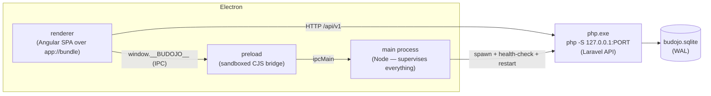

# Budojo Desktop — architecture

How the desktop build (M11, [#1218](https://github.com/Budojo/budojo/issues/1218)) is put together: the process model, the renderer transport, how the bundled PHP API is supervised, and where data lives.

> **Why this exists.** Budojo started as a hosted SPA + Laravel API on DigitalOcean / Forge / Cloudflare. That stack was decommissioned in [#1230](https://github.com/Budojo/budojo/issues/1230) — the running cost outgrew a single-instructor tool. The desktop build packages the *same* Angular SPA and Laravel API into one Windows application that runs entirely on the owner's machine, with no server, no account, and no monthly bill. The archived hosted runbook is at [`../infra/archive/production-deployment.md`](../infra/archive/production-deployment.md).

## Process model

Three processes, plus one supervised child:

- **Main process** (`desktop/src/main.ts`) owns the app lifecycle: it boots the runtime (first-run bootstrap, secrets, migrations), spawns and supervises PHP, registers the `app://` protocol, holds the single-instance lock, and wires the IPC bridge. It is the only process with Node/OS access.
- **Preload** (`desktop/src/preload.cts`) is the *only* thing the renderer can see of the main process. Written as `.cts` because preload scripts run as CommonJS and an ESM preload is silently not loaded under `sandbox: true`. It exposes a deliberately tiny surface on `window.__BUDOJO__` (see [IPC surface](#ipc-surface)).
- **Renderer** is the unmodified Angular SPA, served over `app://bundle` (see [The `app://` scheme](#the-app-scheme)). It talks to the API over HTTP exactly as the web build does — the desktop shell is transport, not a fork of the app.
- **PHP** is a bundled `php.exe` running `php -S` bound to `127.0.0.1` on an ephemeral port. It is a child of the main process, health-checked on boot and restarted if it dies.

`contextIsolation` is on, `sandbox` is on, `nodeIntegration` is off. The renderer gets Node capabilities through nothing but the preload bridge.

## The `app://` scheme

The Angular build is served from a **custom `app://bundle` origin**, not `file://`.

- Angular uses `PathLocationStrategy` (real paths like `/dashboard/athletes`, no hash). `file://` has no notion of a directory index or SPA fallback, so a deep link or a refresh would 404. A scheme registered as **`standard` + `secure`** gives the renderer a real web origin with working history, relative URLs, `fetch`, and a secure context (required for service workers, crypto, etc.).
- The protocol handler (`desktop/src/protocol.ts`) serves static files out of the packed `dist/renderer` and **falls back to `index.html`** for any path that isn't a real file — the same SPA-fallback the Cloudflare Worker did for the hosted build ([#382](https://github.com/Budojo/budojo/issues/382), retired with the stack in #1230). The fallback is gated to `GET`/`HEAD` with `Accept: text/html`, so a programmatic `fetch()` of a missing asset gets a real 404 rather than HTML.
- In development (`ELECTRON_DEV=1`) the window loads the `ng serve` dev URL instead, for HMR.

## IPC surface

Everything the renderer needs beyond HTTP is on `window.__BUDOJO__` (typed in `client/src/budojo-bridge.d.ts`). It is intentionally small — the SPA gets almost everything from the API, the same as on the web.

| Member | Direction | Purpose |
|---|---|---|
| `apiBase` | read (sync, via `additionalArguments`) | `http://127.0.0.1:<port>` of the supervised API; `''` on the web. Read during Angular bootstrap, before the first request. |
| `platform` | read | `process.platform` of the host. |
| `onNavigate(cb)` | main → renderer | A clicked native toast asks the SPA to route somewhere ([#1225](https://github.com/Budojo/budojo/issues/1225)). In-app paths only; the renderer still owns routing. |
| `token.{get,set,clear}` | renderer ↔ main (sync) | The Sanctum bearer token, held encrypted in the OS keychain by the main process ([#1227](https://github.com/Budojo/budojo/issues/1227)). `get()` is synchronous so the HTTP interceptor can read it inline. |
| `backup.{list,run,restore}` | renderer → main (async) | Local backup & restore ([#1228](https://github.com/Budojo/budojo/issues/1228)). See [`backup-restore.md`](./backup-restore.md). |
| `keys.{export,import}` | renderer → main (async) | Recovery keys ([#1254](https://github.com/Budojo/budojo/issues/1254)): export decrypts the key store into a copy-pasteable code; import writes it back and relaunches under the new keys. |
| `drive.{state,archives,link,unlink,sync}` | renderer → main (async) | Google Drive backup sync ([#1301](https://github.com/Budojo/budojo/issues/1301)). Answers `configured: false` when the build carries no OAuth client, and the page hides the card rather than offering a button that cannot work. |
| `folder.{state,choose,clear,copy,open}` | renderer → main (async) | The backup folder ([#1320](https://github.com/Budojo/budojo/issues/1320)) — the owner picks a directory their own sync client already watches. |
| `version()` | renderer → main (async) | The running app version, painted in the title bar ([#1401](https://github.com/Budojo/budojo/issues/1401)). A development run reports `0.0.0`, shown as-is. |
| `update.{status,onStatus}` | renderer ↔ main | The update state ([#1339](https://github.com/Budojo/budojo/issues/1339)): `idle`, `checking`, `up-to-date`, `downloading`, `ready`. `status()` for the first paint, `onStatus` for every change after. |
| `update.check()` | renderer → main (async) | Check now instead of waiting for the six-hourly poll ([#1401](https://github.com/Budojo/budojo/issues/1401)). Resolves only with whether a check could be **started**; what it found arrives through `onStatus`, exactly as the automatic check's result does. |
| `update.installNow()` | renderer → main (async) | Quit, run the installer visibly, relaunch ([#1362](https://github.com/Budojo/budojo/issues/1362)). Guarded on the state, so a stale click cannot quit the app to install nothing. |

**The update states are not symmetric with the events.** `checking` and `up-to-date` exist for one reason: before them, a check that found nothing was completely silent, and "nothing to get" was indistinguishable from "never looked". The renderer decides who deserves to hear about them — a press does, the six-hourly poll does not — because the state stream cannot tell the two apart and should not try.

## Runtime profile and capabilities

The server knows which build it is running as through the **`RuntimeProfile`** enum (`web` | `desktop`, set by `BUDOJO_RUNTIME`). The difference between them is expressed as a **set of capabilities**, never an `if (isDesktop)` boolean — a boolean is how a build target quietly becomes a fork.

`config/budojo.php` maps each profile to its capability set:

| Capability | Web | Desktop | What it gates |
|---|:---:|:---:|---|
| `community` | ✅ | ❌ | Social feed / community surfaces |
| `athlete_accounts` | ✅ | ❌ | Athlete self-service logins & invites |
| `web_push` | ✅ | ❌ | Browser Web Push / VAPID notifications |
| `email` | ✅ | ❌ | Outbound SMTP (reminders, invites) |
| `password_breach_check` | ✅ | ❌ | HaveIBeenPwned lookups on password entry |

**Desktop enables none of them** (`'desktop' => []`). It is a single-user local tool: one owner, one machine, no second user to invite, no browser push service to reach, no mail transport, and — because the bundled PHP ships without a CA bundle — no outbound HTTPS. A route behind an absent capability answers **404**, so the multi-user surfaces are not merely hidden in the UI, they don't exist on the wire. Nothing is deleted: flipping the config back on restores the hosted behaviour.

## Drivers

The desktop process is one process on one machine, so it **must** run with these drivers (`config/budojo.php` → `desktop_drivers`, enforced at boot by `DesktopDriverGuard`):

| Setting | Value | Why |
|---|---|---|
| `queue.default` | `sync` | There is no worker. A `database`-queued job would be written and never drained — a certificate-expiry reminder silently lost, no exception, no log. The guard hard-fails at boot rather than let that happen. |
| `cache.default` | `file` | No Redis, no shared DB. |
| `session.driver` | `file` | Same; the API is token-authenticated anyway. |

## Data layout

Everything that persists lives under Electron's **`userData`** directory (`%APPDATA%\Budojo\` on Windows), never beside the executable — the install directory is read-only after install, and an uninstall must not be able to take the owner's data with it (`dataLayout()` in `desktop/src/bootstrap.ts`):

| Path (under `userData`) | What |
|---|---|
| `budojo.sqlite` | The database. SQLite in WAL mode (`+ -wal`, `-shm` siblings). |
| `storage/` | Laravel's `storage/` — **the encrypted documents live here** (`app/private/`), alongside the publicly-served images in `app/public/`. |
| `logs/` | Runtime logs — PHP, scheduler, notifier, backup, update, `auth.log` for the sign-in vault, and `renderer.log` for faults in the window itself (#1317). Everything in `renderer.log` is passed through a redaction step first: the renderer holds the sign-in token, and this file travels inside support bundles. `auth.log` needs no redaction because it never carries the token — it is written on the paths where the token could *not* be stored, and naming it there would hand over the plaintext copy the vault exists to avoid (#1298). |
| `backups/` | Local backup archives (see [`backup-restore.md`](./backup-restore.md)). |
| `secrets.bin` | `APP_KEY` + `DOCUMENT_ENCRYPTION_KEY`, encrypted with the OS keychain (Electron `safeStorage` → DPAPI on Windows). |
| `auth-token.bin` | The signed-in Sanctum token, same encryption. |
| `drive-token.bin` | The Google refresh token for backup sync (#1301), same encryption. Its own file, so disconnecting Drive cannot disturb sign-in — and so it stays **outside** `storage/`, where a backup archive would otherwise carry a credential up to the very account it grants access to. |
| `drive-sync.json` | Drive link bookkeeping — account, folder id, last sync, last error. Holds no secret. |
| `backup-folder.json` | Which folder backups are copied into and how that last went (#1320). Holds no secret. |
| `bootstrap.json` | First-run state marker. |
| `php.ini`, `php-server.pid` | Generated PHP config + supervisor pid. |
| `notifications-ledger.json` | Once-only ledger so a native reminder fires at most once. |
| `tmp/` | Scratch (backup staging, etc.). |

### How images reach the renderer

Avatars, academy logos and community video thumbnails are stored on Laravel's `public` disk and referenced by the API as `Storage::disk('public')->url(...)` — i.e. `http://127.0.0.1:<port>/storage/<path>`. On a normal web deployment that path is a **static file**, reachable because `public/storage` symlinks into `storage/app/public`.

**That symlink cannot exist here.** The install directory is read-only by design, `storage/` lives under `userData`, and creating a symlink on Windows needs Developer Mode or elevation. So the `public` disk is configured with `'serve' => true` (`server/config/filesystems.php`), which makes Laravel register `/storage/{path}` and serve the file through PHP instead. `visibility: public` is what lets it answer without a signed URL — an `` could never supply one.

Nothing changes for the hosted/dev shape: nginx and PHP's built-in server both serve an existing file before reaching the router, so where the symlink is present the route never runs. It is a fallback, not a replacement ([#1302](https://github.com/Budojo/budojo/issues/1302)).

Two consequences worth knowing rather than rediscovering:

- **`serve` registers a PUT as well as a GET.** `storage.public.upload` writes the request body onto the disk. It requires `?upload=1` *and* a valid relative signature — no `visibility: public` bypass, unlike the GET — so it needs the `APP_KEY`, and nothing in the app mints such a URL. `PublicStorageTest` pins that gate.
- **The route disables browser caching.** Laravel's `ServeFile` hard-codes `Cache-Control: no-store`, so on the desktop — where this route is the only path — every avatar and logo is re-streamed through PHP on each render, instead of being the cacheable static file a symlinked deployment serves. Acceptable at single-user, single-machine scale; `Storage::disk('public')->serveUsing(...)` is the escape hatch if it ever matters.

The install directory holds only the read-only runtime: `resources/php/php.exe` (the bundled PHP), `resources/server/` (the Laravel app, `--no-dev`), and the renderer inside `app.asar`. Because nothing user-owned lives there, the NSIS uninstaller is configured with `deleteAppDataOnUninstall: false` — uninstalling removes the program and leaves every byte of the gym's data in place.

That path comes from the `appId`/`productName`, **not** from where the executable sits, which has one consequence worth knowing while developing: a locally-built exe and the installed release share the *same* `%APPDATA%\Budojo\`. Test builds with `--user-data-dir=<scratch>` (honoured by the packaged app) so a half-finished migration never meets real data.

## Secrets

On first run the bootstrap generates two 32-byte random keys — `APP_KEY` (Laravel's, `base64:`-prefixed) and `DOCUMENT_ENCRYPTION_KEY` (the medical-certificate cipher, `config/documents.php`) — and writes them to `secrets.bin`, encrypted with the OS keychain. On every later boot it decrypts `secrets.bin` and injects the keys into the PHP child's environment.

If a database already exists but `secrets.bin` is gone, the bootstrap **refuses to generate new keys over existing data** and fails loudly — new keys would render every encrypted column and document permanently unreadable while looking like they'd been "reset". This behaviour is the crux of the disaster-recovery story; read [`backup-restore.md`](./backup-restore.md) before trusting a backup with a fresh machine.

Because a backup never carries `secrets.bin` and the keychain binds it to one Windows user, the keys can be exported as a portable **recovery code** (#1254) and re-imported on another machine — the only way a fresh-machine restore can decrypt the documents. See [`backup-restore.md` § Recovery keys](./backup-restore.md#recovery-keys).

## Scheduling

There is no cron and no worker. Periodic work (document-expiry checks that raise native reminders) runs **in-process** on a `PeriodicTask` primitive ([#1226](https://github.com/Budojo/budojo/issues/1226)) inside the main process, on a desktop cadence (frequent checks inside daytime windows, idempotent via the notifications ledger). The web build's SMTP reminders are simply an absent capability here.

## See also

- [`install.md`](./install.md) — installing, first run, upgrades, the SmartScreen warning.
- [`backup-restore.md`](./backup-restore.md) — backup, restore, and the disaster-recovery runbook.
- [`../infra/archive/production-deployment.md`](../infra/archive/production-deployment.md) — the decommissioned hosted stack (historical).
